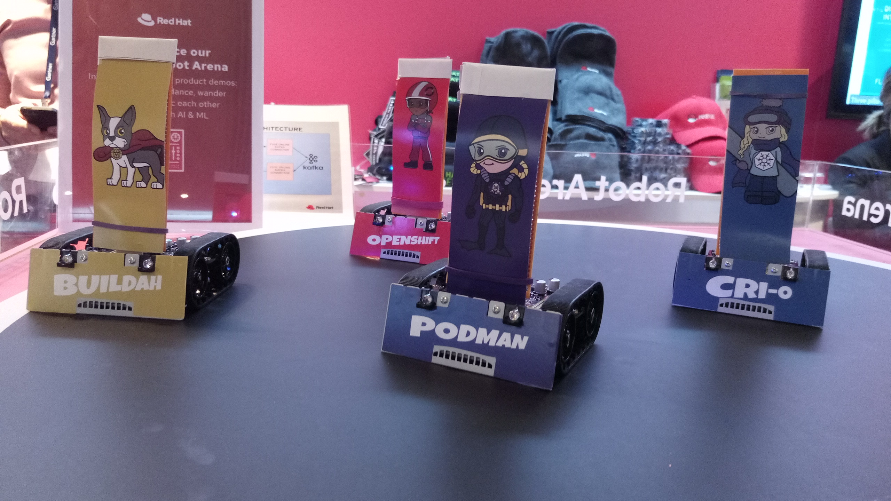
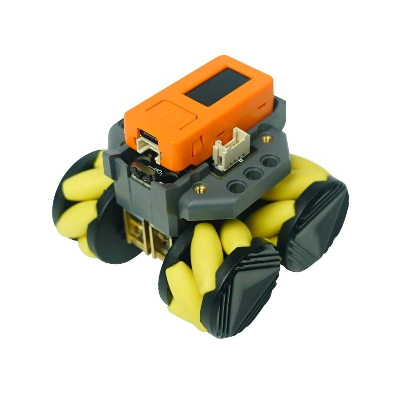
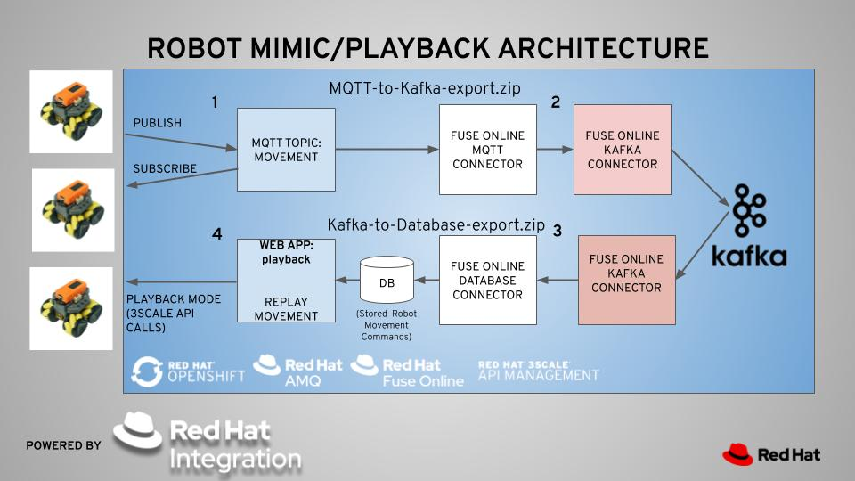
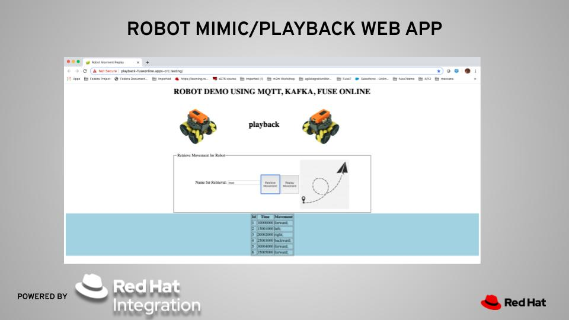
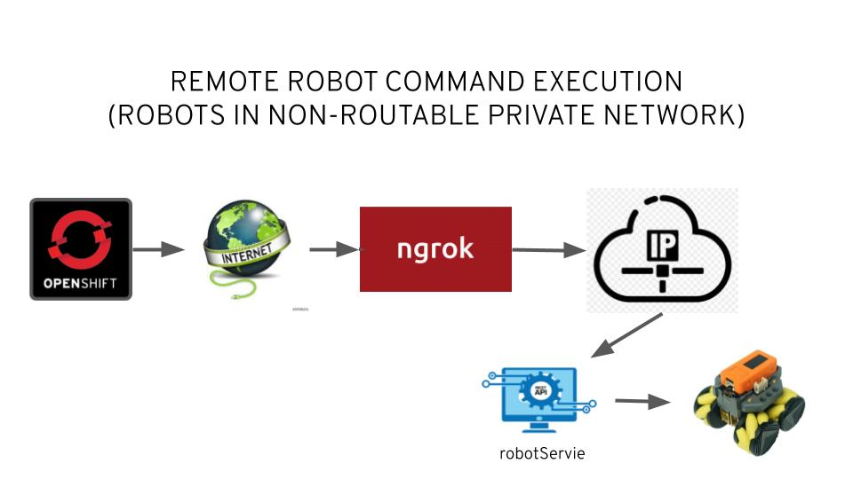
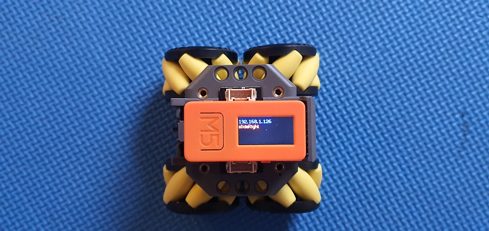
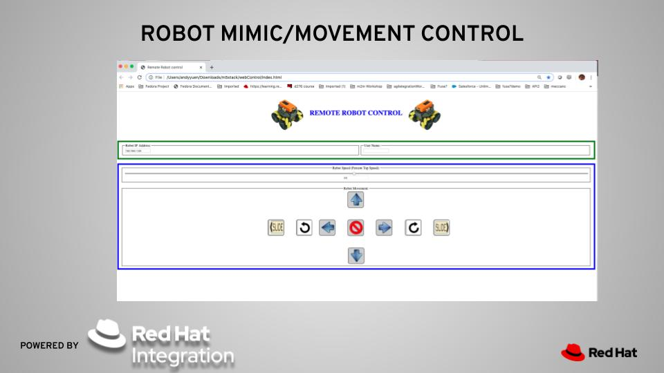

# robot-demo-v2

## This is version 2 of the Robot Demo involving MQTT, Fuse Online, AMQ Streams (Kafka) and physical robots.

The Robot Demo using Generation One robots attracted lots of attention during the 2019 Sydney Gartner Application Architecture, Development & Integration Summit. The robots are shown below:

Owing to the fact that the generation one robots use a bespoke WIFI hardware extension card that had to be hand-built, it becomes an inconvenience for others to replicate the demo. In view of this, I started looking for new robots that don’t require bespoke builds. The specifications of the newly chosen robot made up of two components shown in the following links:

[M5StickC ESP32-PICO Mini IoT Development Kit](https://m5stack.com/collections/m5-core/products/stick-c)
[RoverC W/O M5StickC](https://m5stack.com/collections/m5-unit/products/rovercw-o-m5stickc)

This is what the new robot looks like. 

As this is an off-the-shelf robot, everyone can easily replicate the demos once the code is available here on Github. The good thing is that each robot costs under US$60.

A youtube video describing the development of the robots from prototype to generation two can be found below:
[ROBOTS  FOR GARTNER AADI SUMMIT - FROM PROTOTYPE TO GENERATION 2](https://youtu.be/NQU0mi6Qvm8)

Here is a high-level view of all the components involved in the demo:

## Application in each Directory
Openshift Version 4.2.10 was used in testing.
### fuseonline (on Openshift)
This directory contains 2 Fuse Online integrations:
* MQTT-to-Kafka-export.zip - this integration is responsible for the top path in the architecture diagram ie, from MQTT to Kafka
* Kafka-to-Database-export.zip - this integration is responsible for the bottom path in the architecture diagram ie, from Kafka to the MySQL database

You have to import these 2 integrations from the Fuse Online GUI and published them.

### images
This directory contains the images used in the README.me file.

### playback (deployed to Openshift)

### Prerequisites

* Deployed a MySQL database V5.7 in your Fuse Online Project
* Initialised the MySQL database with the src/main/resources/mysql.sql script

### Deployment
Follow the following steps (assuming you've already created a project named playback on Openshift and updated the src/main/resources/application.properties file to reflect the mysql-specific parameter values):

* oc policy add-role-to-user view -n playback -z default
* oc create configmap playback --from-file=src/main/resources/application.properties -n playback
* oc get configmap playback -o yaml -n playback
* mvn clean fabric8:deploy -Dmaven.test.skip=true -Popenshift -Dfabric8.namespace=playback
* create a route for playback if required
* access the route and you will see a web interface as show below

playback web interface:

### robotService (run locally in the same private network where the robots are connected to)
Here is the setup:
 

As the Openshift instance running in the Internet is not able to access a non-routable network where the robots are connected to. We need to make use of the ngrok service to expose the robotService running on a PC connected to the same network as the robots. Applications running on Openshift can now command the robots via the robotService exposed using a ngork tunnel.

[What is ngrok?](https://ngrok.com/product)
## Deployment

This is meant to be run in the same private non-routable network as you robots and not on Openshift.

* modify the robotNames hashmap in CommandEnpoin.java to associate the correct IP address with each robot
* mvn clean spring-boot:run
* start ngrok tunnel to allow access to your robotService from the Internet

### rover (Arduino Project)
This is an Arduino project. The rover application needs to be flashed onto the robots using the Arduino IDE.

The robot.ino contains two define statements:
<pre>
#define _LEADER
//#define _FOLLOWER
</pre>

Comment out one or the other. _LEADER sends all movements received from webControl (discussed later) and forward them to a public MQTT server's "movement" topic. _FOLLOWER subscribes to the "movement" topic and execute the movement commands. It still receives commands from WebControl and executes them but does not send them to a remote MQTT server.

The robot screen displays the robot's IP address and the last movement command that has been executed. The screen content is shown below:

To compile the app, you need to use the Tools->Manage Libraries... to install the following libraries:
* Library for M5StackC Core development kit
* ArduinoJson
* aREST
* PubSubClient

### webControl (this is a web page that runs locally on you laptop which connects to the same private network where the robots are connected)
This is a web page that controls a remote robot whose IP address is set in the "Robot IP Address" field. No web server deployment is required.
You must run it on a computer connected to the same private network where the robots are  connected to.
 
